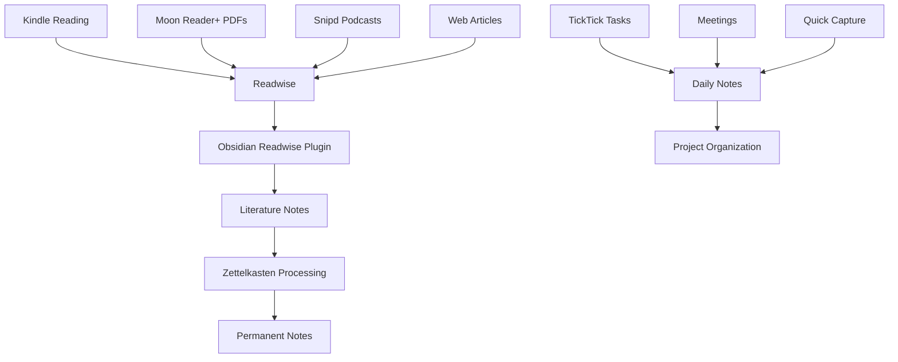

# Current PKMS System - Architecture & Integration Analysis

> **Status**: Active Development | **Priority**: High | **Owner**: Personal
> **Purpose**: Document current Personal Knowledge Management System architecture and plan voice-centric enhancements

## 🏗️ Current System Architecture

### Core Components

#### 1. **Obsidian Vault** (Central Hub)
- **Role**: Primary knowledge repository and daily workflow management
- **Structure**: PARA method + Zettelkasten hybrid
- **Key Features**: 
  - Daily notes with task integration
  - Atomic knowledge building (Zettelkasten)
  - Visual knowledge graphs and connections
  - Template-driven content creation

#### 2. **Readwise** (Content Aggregation Layer)
- **Role**: Central content ingestion and processing hub
- **Integrations**:
  - **Kindle**: Highlights and annotations from ebooks
  - **Moon Reader+**: PDF annotations and highlights  
  - **Snipd**: Podcast transcript highlights and notes
  - **Articles**: Web content highlights via browser extension
- **Output**: Processed highlights → Obsidian via Readwise plugin

#### 3. **TickTick** (Task Management)
- **Role**: Structured task management with priorities and due dates
- **Integration**: Sync with Obsidian daily notes via TickTick plugin
- **Structure**: 
  - Inbox for triage
  - Context-based lists (MCO, MHM, Personal)
  - Priority-based filtering (High/Urgent only in daily notes)

#### 4. **Daily Notes System** (Workflow Hub)
- **Role**: Central command center for daily activities
- **Features**:
  - Three-area separation (Personal/MCO/MHM)
  - Meeting creation and person linking
  - Task aggregation from TickTick
  - Quick capture and processing

## 🔄 Current Content Flow



## 🎯 Voice-Centric Enhancement Plan

### Plaud Integration Strategy

#### 1. **Voice Capture → Transcription Pipeline**
- **Input**: Plaud device recordings (meetings, thoughts, ideas)
- **Processing**: Automatic transcription via Plaud app
- **Output Options**:
  - Direct to Obsidian via API/webhook
  - Email integration for processing
  - Manual export and import workflow

#### 2. **Content Processing Workflow**
```
Voice Recording → Plaud Transcription → Content Classification → Obsidian Integration
```

**Classification Rules**:
- **Meeting Content** → Archive/Meetings with person tagging
- **Task Items** → TickTick integration or Quick Tasks
- **Ideas/Insights** → Zettlekasten processing
- **Project Notes** → Relevant project folders

#### 3. **Plaud + TickTick Integration**
**Voice-to-Task Workflow**:
1. Record voice note with task details
2. Plaud transcribes and identifies action items
3. Automatic parsing for:
   - Task description
   - Due date (if mentioned)
   - Priority level (urgent/high/normal)
   - Context (MCO/MHM/Personal)
4. Direct creation in TickTick with proper tagging
5. Sync to daily notes via existing TickTick plugin

## 🛠️ Implementation Roadmap

### Phase 1: Basic Voice Integration (Weeks 1-2)
- [ ] Set up Plaud device and app
- [ ] Configure transcription quality settings
- [ ] Establish manual export → Obsidian workflow
- [ ] Create voice note processing templates

### Phase 2: Automated Processing (Weeks 3-4)  
- [ ] Configure Plaud → email integration
- [ ] Set up email processing rules for content routing
- [ ] Create Obsidian automation for voice note processing
- [ ] Test end-to-end workflow with sample recordings

### Phase 3: TickTick Integration (Weeks 5-6)
- [ ] Research Plaud API capabilities for task extraction
- [ ] Configure voice-to-task parsing rules
- [ ] Set up automated TickTick task creation
- [ ] Test integrated voice task management workflow

### Phase 4: Advanced Features (Weeks 7-8)
- [ ] Implement smart content classification
- [ ] Add voice note search and indexing
- [ ] Create voice-activated daily note updates
- [ ] Establish voice-based meeting note creation

## 📊 Success Metrics

### Voice Integration KPIs
- **Capture Rate**: % of ideas captured vs. lost
- **Processing Time**: Voice note → organized content (target: <5 minutes)
- **Task Accuracy**: Voice tasks correctly categorized (target: >90%)
- **Usage Frequency**: Voice captures per day (target: 5-10)

### Workflow Efficiency Gains
- **Meeting Notes**: 50% reduction in post-meeting processing time
- **Task Capture**: 75% increase in on-the-go task recording
- **Idea Retention**: 90% improvement in capturing fleeting thoughts
- **Context Switching**: 60% reduction in device/app switching

## 🔧 Technical Requirements

### Plaud Device Configuration
- Audio quality settings for transcription accuracy
- Sync frequency with mobile app
- Battery management for all-day use
- Cloud storage integration

### Integration Points
- **Obsidian**: Templater automation for voice note processing
- **TickTick**: API access for automated task creation
- **Email**: Processing rules for content routing
- **Mobile**: Seamless capture and processing workflow

## 🚨 Potential Challenges

### Technical Challenges
- Transcription accuracy for technical content
- Audio quality in noisy environments  
- Network connectivity for real-time sync
- Battery life during long recording sessions

### Workflow Challenges
- Over-reliance on voice input reducing typing skills
- Processing backlog if automation fails
- Content classification accuracy
- Privacy concerns with sensitive recordings

### Mitigation Strategies
- Hybrid input methods (voice + manual)
- Fallback manual processing workflows
- Regular accuracy audits and corrections
- Secure, local-first processing where possible

---

## 🔗 Related Resources

- [[Current Daily Note Template]]
- [[TickTick Integration Documentation]]
- [[Readwise Configuration]]
- [[Voice Workflow Templates]]

*Last Updated: {{date}}*
*Next Review: Weekly*