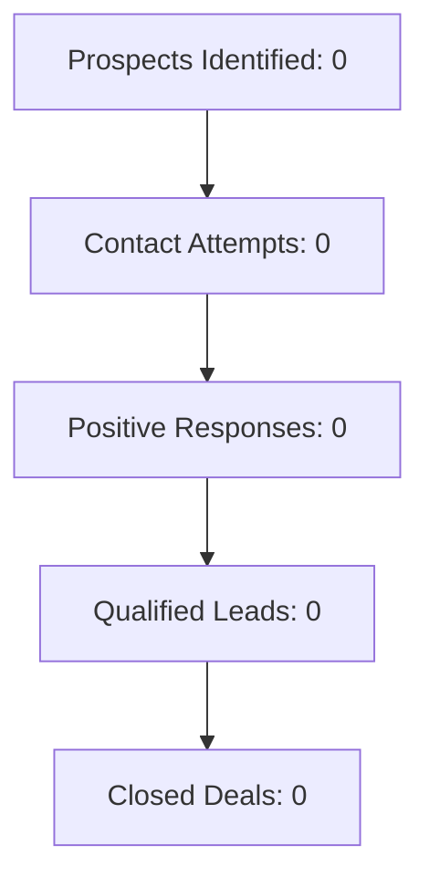

# {{title}}

## Campaign Overview

**Type:** Geographic Targeting  
**Status:** 🟢 Active  
**Duration:** {{date:YYYY-MM-DD}} - {{VALUE:end_date}}  
**Target:** {{VALUE:city}}, {{VALUE:state}} ({{VALUE:radius}} mile radius)  

---

## Targeting Criteria

### Geographic
- **Primary Location:** {{VALUE:city}}, {{VALUE:state}}
- **Search Radius:** {{VALUE:radius}} miles
- **Market Focus:** Local businesses within target area

### Business Profile
- **Industries:** {{VALUE:industries}}
- **Company Size:** {{VALUE:min_employees}} - {{VALUE:max_employees}} employees
- **Revenue Range:** ${{VALUE:min_revenue}} - ${{VALUE:max_revenue}}
- **Qualification Threshold:** 60+ points

---

## Campaign Goals & Targets

| Metric | Daily Target | Monthly Target | Current |
|--------|-------------|----------------|---------|
| **Prospects Identified** | {{VALUE:daily_target}} | {{VALUE:monthly_target}} | 0 |
| **Contact Attempts** | - | - | 0 |
| **Positive Responses** | - | - | 0 |
| **Qualified Leads** | - | - | 0 |
| **Pipeline Value** | - | ${{VALUE:pipeline_target}} | $0 |

---

## Performance Metrics

### Conversion Funnel


### Key Performance Indicators
- **Response Rate:** 0% (Target: 15%+)
- **Qualification Rate:** 0% (Target: 5%+)
- **Average Deal Size:** $0 (Target: $3,000)
- **Cost Per Lead:** $0
- **Pipeline Velocity:** 0 days

---

## Messaging Strategy

### Primary Value Proposition
*To be developed based on market research*

### Key Talking Points
1. **Local Market Focus:** Understanding of local business challenges
2. **Digital Marketing ROI:** Measurable results and clear ROI
3. **Competitive Analysis:** Free audit showing gaps vs competition
4. **Proven Process:** Case studies from similar local businesses

### Free Analysis Offer
- **Deliverables:** Competitor comparison, digital presence audit, growth opportunities
- **Value:** $500+ analysis provided free
- **Purpose:** Build trust and demonstrate expertise

---

## A/B Testing Framework

### Current Tests
*No active tests*

### Planned Tests
- [ ] Subject line variations (email)
- [ ] Opening hook variations (calls)
- [ ] Value proposition messaging
- [ ] Call-to-action approaches
- [ ] Follow-up timing intervals

---

## Agent Assignments

| Agent | Role | Status |
|-------|------|--------|
| **Prospecting Agent** | Identify & qualify prospects | Active |
| **Pitch Creator Agent** | Develop customized messaging | Standby |
| **Voice AI Agent** | Make initial contact calls | Standby |
| **Email Agent** | Send follow-up sequences | Standby |

---

## Progress Tracking

### Pipeline Stages
```dataview
TABLE
    company as "Company",
    pipeline_stage as "Stage",  
    qualification_score as "Score",
    updated as "Last Updated"
FROM "Projects/Sales/Prospects"
WHERE contains(tags, "{{title}}")
SORT qualification_score DESC
```

### Recent Activities
```dataview
TABLE
    prospect as "Company",
    activity_type as "Activity", 
    outcome as "Outcome",
    date as "Date"
FROM "Projects/Sales/Activities" 
WHERE contains(tags, "{{title}}")
SORT date DESC
LIMIT 10
```

---

## Campaign Notes

### Strategy Notes
*Document key strategic decisions and reasoning here*

### Market Research Insights
*Record key findings about target market, competitors, and opportunities*

### Optimization Opportunities
*Track ideas for improving campaign performance*

---

## Related Files

**Prospects:** `[Projects/Sales/Prospects]` with tag `{{title}}`  
**Activities:** `[Projects/Sales/Activities]` with tag `{{title}}`  
**Templates:** [[Resources/General/Templates/Sales/Prospect-Profile]]

---

*Campaign created on {{date:YYYY-MM-DD}} - Managed by automated sales system*